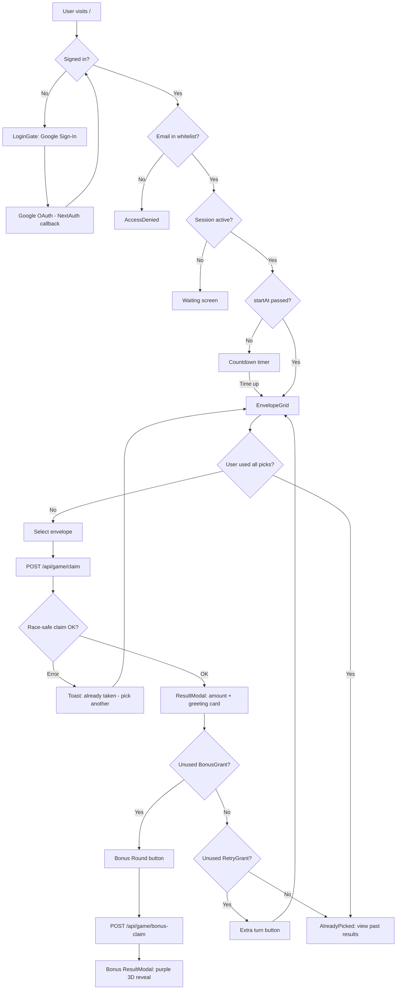
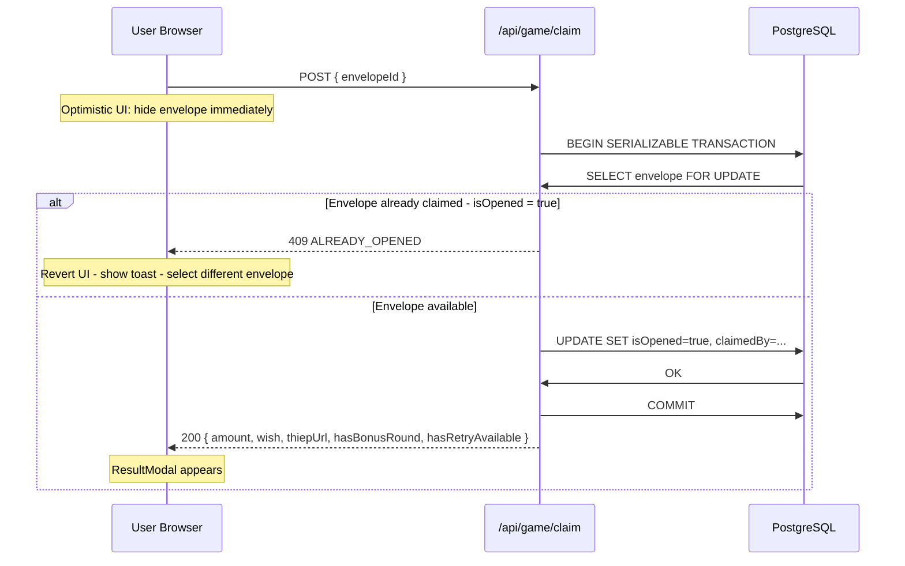
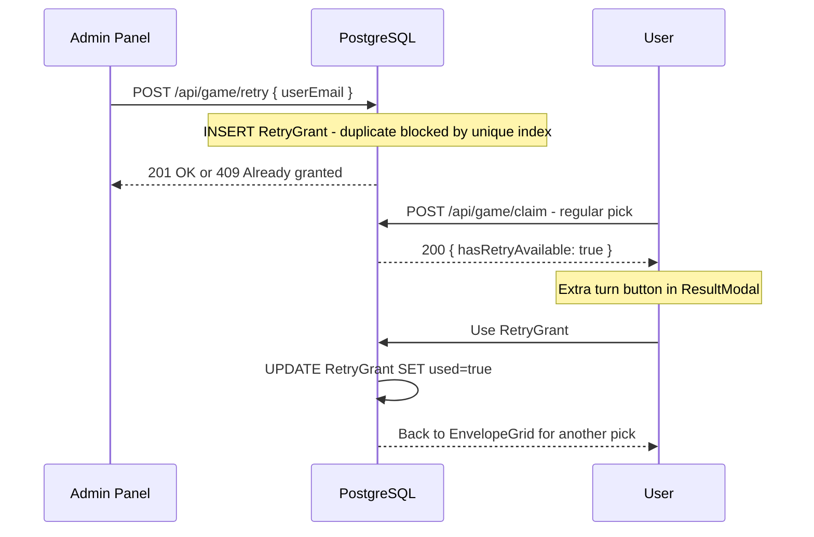
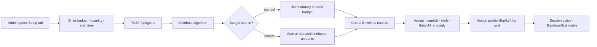
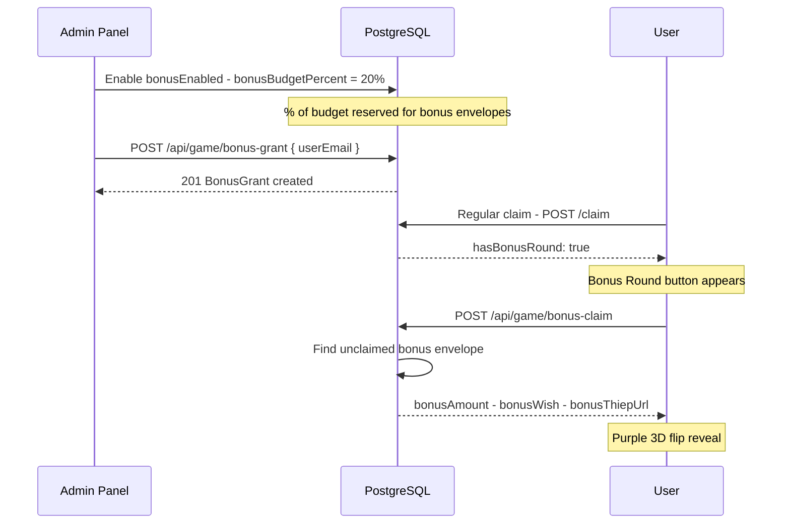

# System Flow — Lucky Money

🌐 **Language / Ngôn ngữ / 言語:** [🇻🇳 Tiếng Việt](../../docs/system-flow.md) · 🇬🇧 English · [🇯🇵 日本語](../ja/system-flow.md)

📚 **Other docs:** [Architecture](architecture.md) · [Admin Guide](admin-guide.md) · [User Guide](user-guide.md) · [Deployment](deployment.md)

---

## 1. Overall Flow



---

## 2. Envelope Claim Flow (Race-Safe)

> [!IMPORTANT]
> **Race-Safe** guarantees no two users can claim the same envelope, even if they tap simultaneously. PostgreSQL `SERIALIZABLE` isolation + `SELECT ... FOR UPDATE` is the technical lock.



**Why is Race-Safe necessary?**
- 2 users tap the same envelope within milliseconds
- Without a lock: both `SELECT isOpened = false` and both UPDATE
- With `SERIALIZABLE` + `FOR UPDATE`: user 2 blocks until user 1 commits, then re-reads and sees `isOpened = true` → returns 409

---

## 3. Extra Turn Flow (RetryGrant)

> [!NOTE]
> When admin grants a retry or the system auto-grants based on `retryPercent`, the user gets an **extra pick** returning to EnvelopeGrid after their first pick.



---

## 4. Session Creation (Admin)



---

## 5. Bonus Round Flow



---

## 6. Polling

`page.tsx` polls `/api/game` every **5 seconds** when tab is visible:

```
Tab visible  -> startPolling() -> setInterval 5s -> fetchSession()
Tab hidden   -> stopPolling()
Tab focus    -> fetchSession() immediately + startPolling()
Claiming in progress (isClaimingRef=true) -> skip poll to avoid interruption
```

---

📚 **Read next:** [Architecture](architecture.md) · [Admin Guide](admin-guide.md) · [Deployment](deployment.md)
