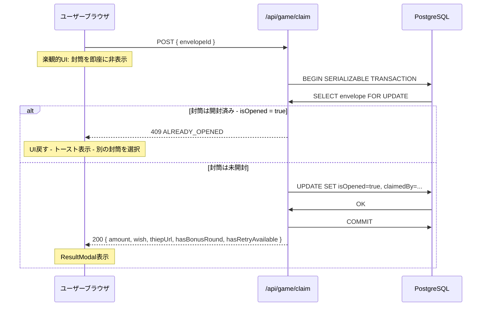
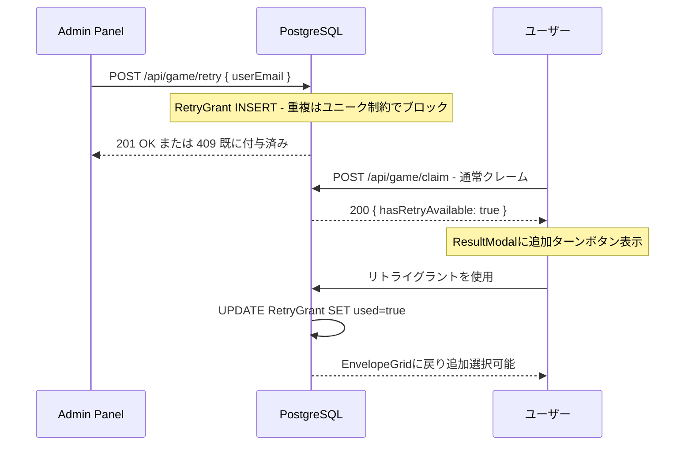

# システムフロー — Lucky Money

🌐 **言語 / Language / Ngôn ngữ:** [🇻🇳 Tiếng Việt](../../docs/system-flow.md) · [🇬🇧 English](../en/system-flow.md) · 🇯🇵 日本語

📚 **他のドキュメント:** [管理者ガイド](admin-guide.md) · [ユーザーガイド](user-guide.md)

---

## 封筒クレームフロー（レースセーフ）

> [!IMPORTANT]
> **レースセーフ**機能により、2人のユーザーが同時に同じ封筒をタップしても、どちらかのみがクレームできます。PostgreSQLの`SERIALIZABLE`分離レベルと`SELECT ... FOR UPDATE`がロック機構です。

---

## 追加ターンフロー（リトライグラント）

> [!NOTE]
> 管理者が手動で付与するか、`retryPercent`に基づいて自動付与されると、ユーザーは通常の抽選後に**追加の封筒選択**ができます。

---

📚 **次を読む:** [管理者ガイド](admin-guide.md) · [ユーザーガイド](user-guide.md)
