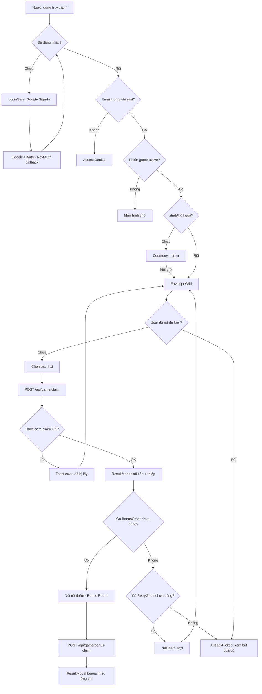
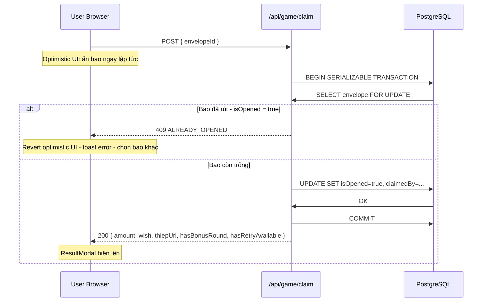
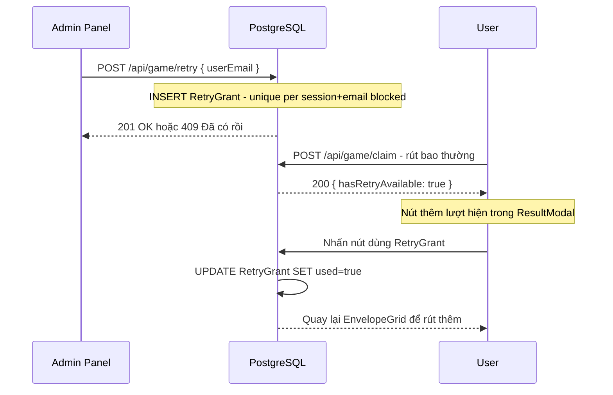
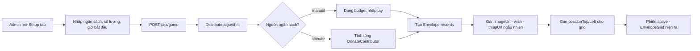
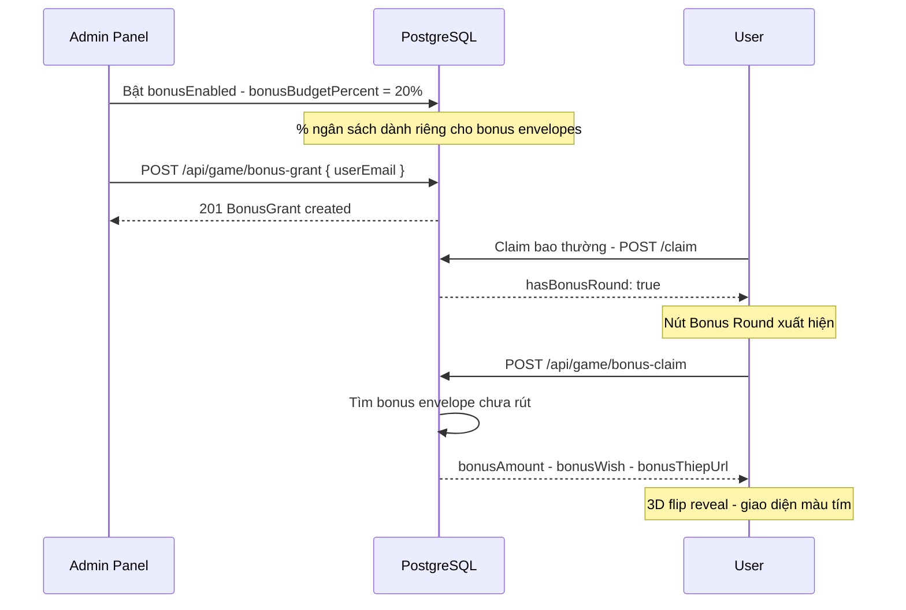
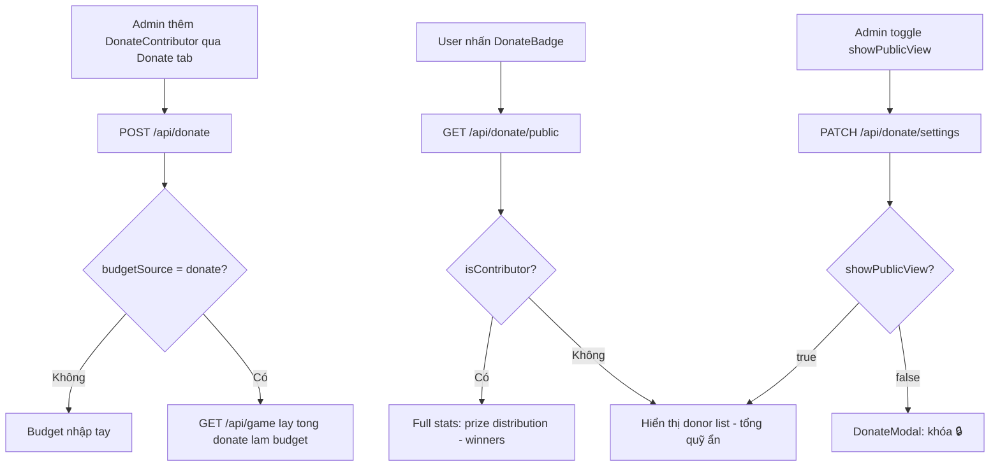
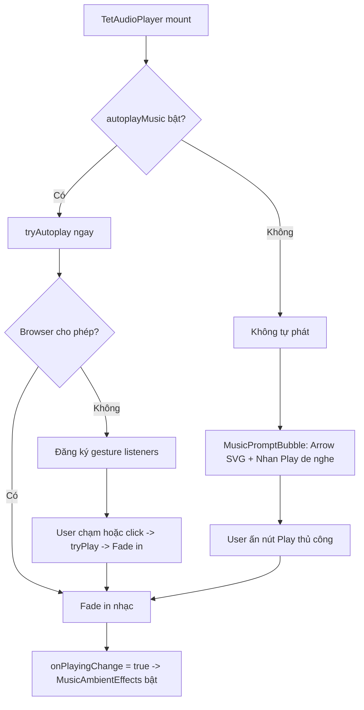
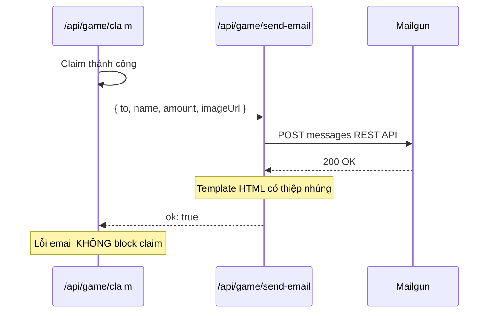

# System Flow — Lucky Money

🌐 **Ngôn ngữ / Language / 言語:** 🇻🇳 Tiếng Việt · [🇬🇧 English](en/system-flow.md) · [🇯🇵 日本語](ja/system-flow.md)

📚 **Tài liệu khác:** [Kiến trúc](architecture.md) · [Hướng dẫn Admin](admin-guide.md) · [Hướng dẫn User](user-guide.md) · [Deployment](deployment.md) · [Customization](customization.md)

---

## 1. Luồng Tổng Thể



---

## 2. Luồng Claim Bao Lì Xì (Race-Safe)

> [!IMPORTANT]
> Cơ chế **Race-Safe** đảm bảo không có 2 người có thể rút cùng 1 bao, dù họ nhấn đồng thời. PostgreSQL `SERIALIZABLE` isolation + `SELECT ... FOR UPDATE` là chốt chặn kỹ thuật.



**Tại sao cần Race-Safe?**
- 2 người cùng nhấn vào 1 bao trong vòng milliseconds
- Không có transaction lock: cả 2 đều `SELECT isOpened = false` và cùng UPDATE
- Với `SERIALIZABLE` + `FOR UPDATE`: người thứ 2 bị block cho đến khi người thứ nhất commit, sau đó đọc lại và thấy `isOpened = true` → trả về 409

---

## 3. Luồng Thêm Lượt Rút (RetryGrant)

> [!NOTE]
> Khi admin cấp retry hoặc hệ thống tự cấp theo `retryPercent`, user nhận được **thêm lượt** quay lại EnvelopeGrid sau khi đã rút xong.



---

## 4. Luồng Tạo Phiên (Admin)



---

## 5. Luồng Distribute Algorithm

File: `src/lib/distribute.ts`

```
Input: budget (VND), quantity (số bao), denominations (mệnh giá + weight)

1. Weighted random pick N denominations theo weight
2. Sum kiểm tra: nếu tổng khác budget -> điều chỉnh bao cuối cùng
3. Shuffle mảng (Fisher-Yates)
4. Gán ảnh, lời chúc, thiệp ngẫu nhiên cho mỗi bao
5. Gán toạ độ (positionTop, positionLeft) trên grid
Output: Envelope[] records
```

---

## 6. Luồng Bonus Round



---

## 7. Luồng Quỹ Donate



---

## 8. Luồng Audio (Autoplay)



---

## 9. Luồng Polling

`page.tsx` poll `/api/game` mỗi **5 giây** khi tab visible:

```
Tab visible  -> startPolling() -> setInterval 5s -> fetchSession()
Tab hidden   -> stopPolling()
Tab focus    -> fetchSession() ngay + startPolling()
Đang claiming (isClaimingRef=true) -> skip poll để không interrupt
```

---

## 10. Luồng Email Notification



---

📚 **Đọc tiếp:** [Kiến trúc hệ thống](architecture.md) · [Hướng dẫn Admin](admin-guide.md) · [Deployment](deployment.md)
